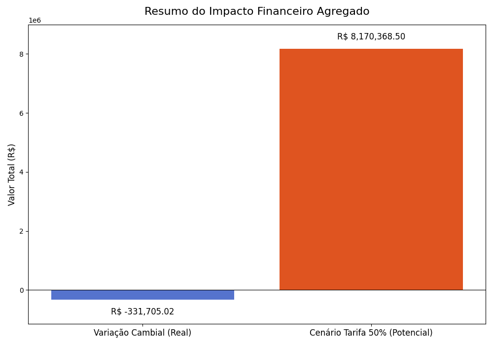

# Análise de Risco Cambial e Tarifário para Operações de Comex
### *Currency and Tariff Risk Analysis for Foreign Trade Operations*

**Status:** Concluído ✔️

---

### 🇧🇷 Resumo do Projeto
Este projeto realiza uma análise de dados completa para quantificar o impacto financeiro da volatilidade cambial (USD/BRL) e de um potencial risco tarifário em processos de importação originados dos EUA. O objetivo é transformar dados brutos em insights estratégicos para apoiar a tomada de decisão da liderança.

### 🇬🇧 Project Overview
This project provides a comprehensive data analysis to quantify the financial impact of currency volatility (USD/BRL) and a potential tariff risk on import processes originating from the USA. The goal is to turn raw data into strategic insights to support leadership's decision-making.

---

### 🛠️ Ferramentas Utilizadas / Tools Used
* **Python**
* **Pandas:** Para manipulação e análise dos dados.
* **Matplotlib & Seaborn:** Para a criação das visualizações de dados.
* **Google Colab:** Como ambiente de desenvolvimento (IDE).

---

### 📊 Principais Achados / Key Findings

A análise revelou um contraste significativo entre a eficiência operacional interna e a exposição a riscos externos. O principal insight pode ser resumido no gráfico abaixo:

* **Eficiência Cambial:** A gestão de câmbio da empresa gerou uma **economia líquida de R$ 331.705,02** em comparação com as taxas de mercado.
* **Risco Tarifário:** Um cenário com uma nova tarifa de 50% representa um **custo adicional potencial de R$ 8.170.368,50**, um risco 24 vezes maior que a economia gerada.

---

### 🎯 Recomendações Estratégicas / Strategic Recommendations
Com base na análise, as seguintes ações foram recomendadas à diretoria:
1.  **Ação Imediata:** Iniciar um estudo de viabilidade para **diversificar a base de fornecedores** para fora dos EUA, a fim de mitigar o risco tarifário de R$ 8,17 milhões.
2.  **Ação de Médio Prazo:** Implementar um **dashboard de monitoramento contínuo** para acompanhar os indicadores de risco cambial e performance.
3.  **Ação de Longo Prazo:** Incluir a **análise de risco geopolítico** como critério formal na seleção de novos mercados e fornecedores.

---
